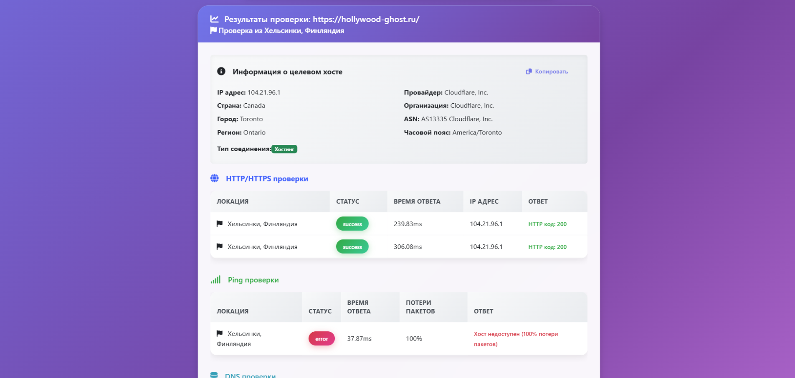

# CheckHost

A service for checking the availability of websites and servers

[See it live](https://checkhost.hollywood-ghost.ru/)

## Features

- **HTTP/HTTPS checks** - checking the availability of web servers on ports 80 and 443
- **Ping tests** - measuring response time and packet loss
- **DNS diagnostics** - complete information about DNS records (A, AAAA, MX, NS, TXT, CNAME, SOA)
- **Traceroute** - analysis of the network route to the target host
- **Geolocation** - detailed information about the location and provider of the target IP

## Stack

- vue js cdn
- php

## Requirements

- PHP 7.4+
- Web server (Apache/Nginx)

## Usage

1. Enter the domain or IP address in the input field
2. Select the types of checks (HTTP, Ping, DNS, Traceroute)
3. Click “Check”
4. View the results in the tables

## Support

Join our Telegram channel: [suicide_coding](https://t.me/suicide_coding)
